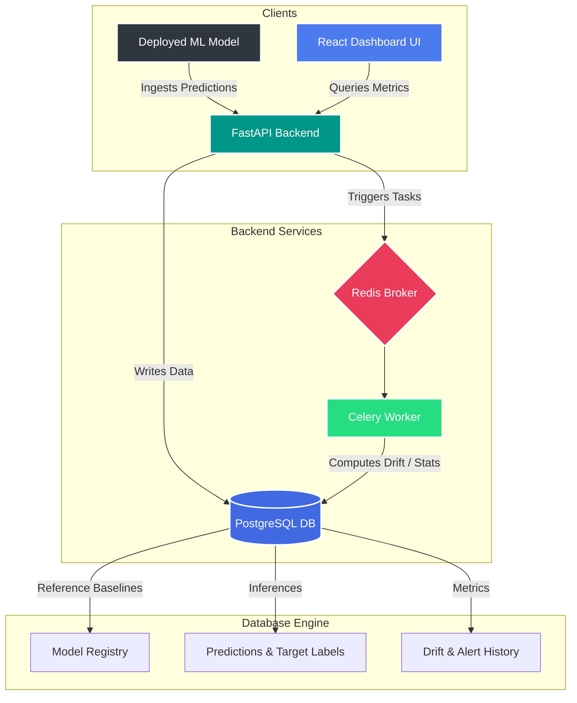

# 🛰️ Sentinel — Production ML Observability Platform

[](https://fastapi.tiangolo.com)
[](https://react.dev)
[](https://www.postgresql.org)
[](https://docs.celeryq.dev)

A production-grade, full-stack **ML Observability Platform** designed to monitor deployed machine learning models in real time. Sentinel tracks model performance, detects data/concept drift, computes probability calibration, and provides explainability—all visualised through an interactive live dashboard.

---

## 🌟 Core Features

* 📊 **Real-time Prediction Ingestion:** Monitor models as they make inferences in production.
* 📈 **Advanced Drift Monitoring:** Detect feature distribution shifts using Population Stability Index (PSI) and Kolmogorov-Smirnov (KS) tests.
* ⏳ **STL Decomposition:** Time-series decomposition for drift metrics to separate trends, seasonality, and residuals.
* 🎯 **Model Calibration & ROC:** Monitor model performance in real time using probability calibration curves, ROC curves, Youden's J statistic, and AUC metrics.
* 🧠 **Explainable AI (SHAP):** Track global and local feature contributions in real-time.
* 🚨 **Automated Alerting:** Trigger Slack/email notifications on critical performance drops or significant drift events.

---

## 🏗️ System Architecture



---

## 🛠️ Quick Start

Sentinel provides a pre-configured Docker Compose cluster and a manual setup for local development.

### 🔑 Default Credentials
* **URL:** [http://localhost:3000](http://localhost:3000)
* **Email:** `admin@sentinel.dev`
* **Password:** `sentinel`

### 1️⃣ Run via Docker Compose (Recommended)
Launch the entire stack (FastAPI backend, React frontend, PostgreSQL database, Redis, and Celery workers) with a single command:
```bash
cd infra
docker-compose up -d
```
*Wait ~30 seconds for the database migrations to run and the database to seed.*

---

### 2️⃣ Run Manually (Local Development)

#### **Backend Setup**
1. Navigate to the backend directory and set up a virtual environment:
   ```bash
   cd backend
   python -m venv .venv
   .\.venv\Scripts\activate  # Windows
   # or: source .venv/bin/activate  # macOS/Linux
   ```
2. Install dependencies:
   ```bash
   pip install -e ".[dev]"
   ```
3. Initialize the database and run migrations:
   ```bash
   alembic upgrade head
   ```
4. Seed the database with the 3 real models and initial baseline data:
   ```bash
   python scripts/seed_db.py
   ```
5. Generate simulated real-time predictions and drift events:
   ```bash
   python scripts/generate_real_predictions.py
   ```
6. Start the FastAPI server:
   ```bash
   python -m uvicorn app.main:app --host 0.0.0.0 --port 8000 --reload
   ```

#### **Frontend Setup**
1. Navigate to the frontend directory and install dependencies:
   ```bash
   cd ../frontend
   npm install
   ```
2. Start the Vite development server:
   ```bash
   npm run dev
   ```
   *Dashboard will be available at [http://localhost:3000](http://localhost:3000).*

---

## 📁 Repository Structure

```
Sentinel/
├── backend/            # FastAPI Backend API, Celery Tasks, & Database migrations
│   ├── app/            # Main application source code
│   └── scripts/        # Seeding and real prediction simulators
├── frontend/           # React, TypeScript, and Vite Dashboard
│   └── src/            # Charting, components, Zustand store, and pages
├── ml/                 # Machine learning models, schemas, and training pipelines
│   └── models/         # Trained XGBoost & Scikit-learn models (1, 2, 3)
├── infra/              # Docker Compose environment and configuration
└── docs/               # System documentation & ADRs
```

---

## 📖 Additional Documentation

For more specific guides, please consult:
* 🚀 [Quick Start Reference Card](QUICK_START.md) — Command reference card & service endpoints.
* ⚙️ [Local Setup & Configuration Guide](SETUP_GUIDE.md) — Detailed environment variables and DB configuration.
* 🖥️ [Running Dashboard Instructions](RUN_DASHBOARD.md) — Navigating features and metrics.
* 📝 [Work Summary](WORK_SUMMARY.md) — Implementation logs, performance, and features.
